# Real Estate Support System (RSS)
## Structural Functional Flow Document

**Application:** `re_support` — Frappe / ERPNext v15+ Custom Application  
**Version:** 1.0 | 2026  
**Document Type:** Enterprise Functional Specification & Solution Architecture  
**Audience:** Functional Consultants · Implementation Teams · Business Analysts · QA Engineers · Stakeholders · Developers

---

> **Document Purpose**
> This document provides a comprehensive functional and technical understanding of the Real Estate Support System (RSS). It is designed so that a functional consultant, QA engineer, business analyst, or developer can fully understand the system's architecture, business flows, data models, role logic, and automation without reading the source code directly.

---

# Table of Contents

1. [System Overview](#1-system-overview)
2. [High-Level System Architecture](#2-high-level-system-architecture)
3. [Module-Wise Functional Breakdown](#3-module-wise-functional-breakdown)
4. [End-to-End Business Process Flows](#4-end-to-end-business-process-flows)
5. [Role-Based System Flow](#5-role-based-system-flow)
6. [Database & Data Flow Understanding](#6-database--data-flow-understanding)
7. [API & Service Flow](#7-api--service-flow)
8. [UI / Screen Flow Documentation](#8-ui--screen-flow-documentation)
9. [Automation & Background Process Flow](#9-automation--background-process-flow)
10. [Reports & Analytics Flow](#10-reports--analytics-flow)
11. [Security & Access Control Flow](#11-security--access-control-flow)
12. [Error Handling & Exception Flow](#12-error-handling--exception-flow)
13. [Integration Flow](#13-integration-flow)
14. [Complete System Flow Summary](#14-complete-system-flow-summary)

---

# 1. System Overview

## 1.1 Purpose of the System

The **Real Estate Support System (RSS)** is a purpose-built Frappe custom application installed on top of ERPNext v15+. Its core mission is to digitize and manage the entire **post-handover real estate support value chain** — from the moment a buyer raises a complaint, through field rectification, possession key handover, and regulatory compliance under RERA (Real Estate Regulatory Authority).

## 1.2 Business Problem Solved

Real estate developers face a fragmented support ecosystem after project completion: complaints are tracked in spreadsheets, defect inspections use paper punch-lists, possession handovers miss documentation, and RERA non-compliance is discovered too late. RSS eliminates these silos by providing a single, integrated, audit-ready platform.

## 1.3 Industry / Domain

- **Industry:** Real Estate Development
- **Segment:** Post-Construction Customer Support & Compliance
- **Regulatory Context:** RERA (Real Estate Regulatory Authority) — India

## 1.4 Main Objectives

| Objective | Business Value |
|---|---|
| Centralized complaint management | Eliminates ticket duplication; enforces SLA accountability |
| Automated SLA enforcement | Reduces breach penalties; improves buyer satisfaction |
| Digital defect punch-lists | End-to-end QC trail; reduces contractor disputes |
| Structured possession workflow | Ensures legal compliance; prevents premature key handover |
| RERA case tracking | Reduces penalty risk; provides legal audit trail |
| Buyer self-service portal | Reduces inbound calls by 40–60%; improves transparency |
| Unified reporting & dashboards | Enables data-driven management decisions |

## 1.5 Core Functionalities

1. **Complaint Management** — Support ticketing with SLA policy, category-based auto-assignment, and buyer notification
2. **Defect & Snagging** — Unit-level defect logging with photographs, contractor rectification, and buyer e-sign acceptance
3. **Possession Management** — End-to-end possession workflow: dues check → NOC collection → OC → key handover
4. **RERA Escalation** — RERA portal complaint tracking, legal team management, hearing schedules, and outcome recording
5. **Buyer Portal** — Frappe web portal for buyers: self-service ticket creation, status tracking, possession checklist
6. **Reports & Analytics** — SLA dashboards, TAT reports, RERA risk scores, project-level defect heatmaps

## 1.6 System Scope

| In Scope | Out of Scope |
|---|---|
| Post-handover buyer support | Pre-sales CRM management |
| Defect inspection & rectification | Construction project management |
| Possession documentation & handover | Sales order / booking management |
| RERA complaint & hearing tracking | Unit/inventory master management |
| Buyer self-service web portal | Payment gateway / EMI processing |
| SLA monitoring & escalation | Contractor time & attendance |

## 1.7 Target Users

| User Type | Role in System |
|---|---|
| Support Manager | Oversees all operations; approves escalations; views all reports |
| Support Agent | Manages day-to-day tickets; responds to buyers |
| Site Inspector | Logs defects; performs QC re-inspections |
| Legal Team | Manages RERA complaints; files responses |
| Possession Executive | Orchestrates possession workflow; conducts handovers |
| Finance Team | Verifies dues; processes RERA penalty JVs |
| Buyer | Self-service portal: raises tickets, tracks status |

## 1.8 Business Benefits

- **SLA Compliance Visibility** — Real-time breach detection every 30 minutes
- **Audit-Ready Documentation** — Digital signatures, document attachments, response logs
- **RERA Risk Reduction** — Automated deadline alerts; integrated penalty tracking
- **Multi-Project Support** — All DocTypes filtered by Project — works across entire portfolio
- **Zero Core ERPNext Changes** — All extensions via custom fields fixtures; safe to upgrade ERPNext

---

# 2. High-Level System Architecture

## 2.1 Overall Architecture

RSS is a **Frappe App** (Python/JavaScript) that runs within the Frappe bench ecosystem. It follows Frappe's standard MVC (Model-View-Controller) pattern with an additional Service Layer via `utils/`.

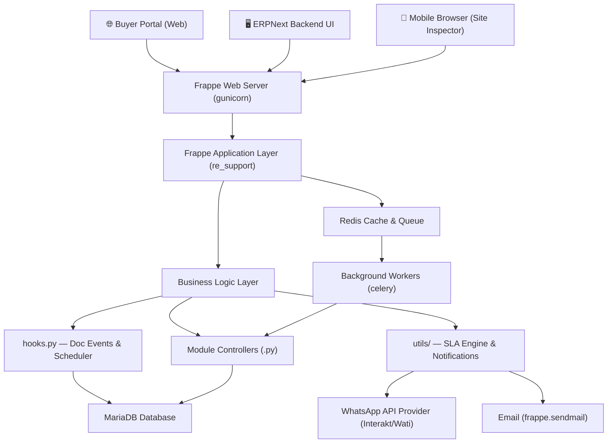

## 2.2 Frontend Architecture

The frontend consists of two distinct layers:

1. **Frappe Desk UI (ERPNext)** — Standard Frappe forms, lists, reports, and dashboards served to internal users (agents, inspectors, legal team). Built with Frappe's form framework + client-side JavaScript (`.js` files per DocType).

2. **Buyer Web Portal** — Frappe's web page framework serving HTML templates (`buyer_portal.html`, `ticket_detail.html`, `possession_status.html`) accessible at public URLs. Authentication via mobile OTP.

## 2.3 Backend Architecture

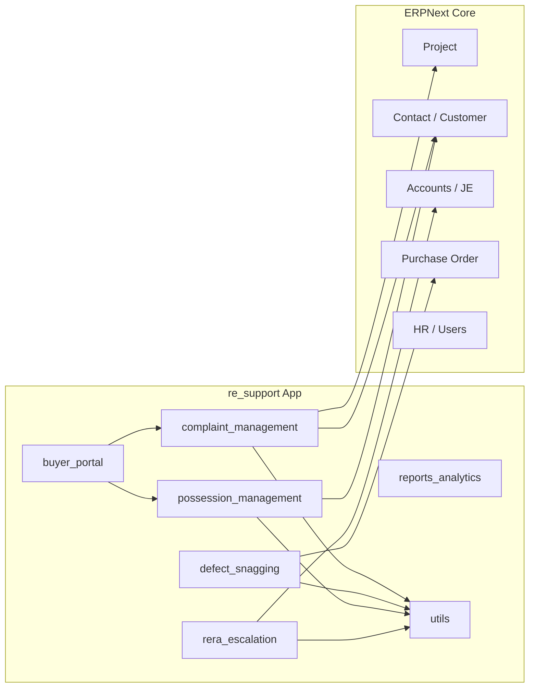

## 2.4 Request-Response Flow

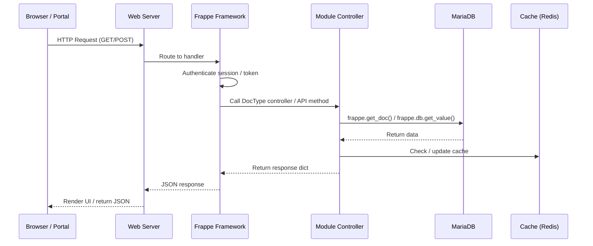

## 2.5 Authentication Flow

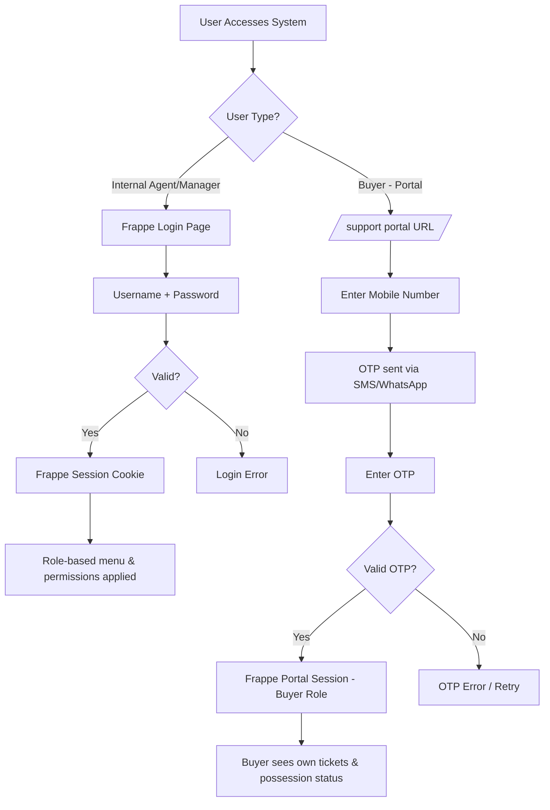

## 2.6 Module Interaction Diagram

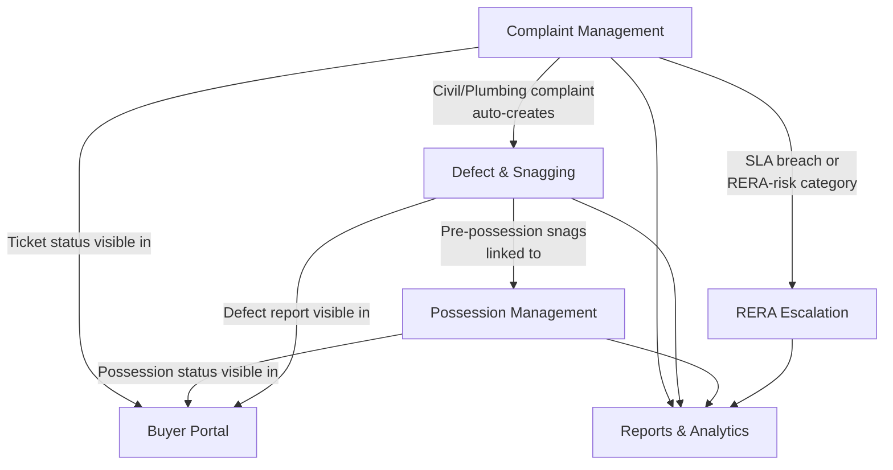

---

# 3. Module-Wise Functional Breakdown

---

## Module 1: Complaint Management

### Purpose
This is the **primary operational module** used daily by the support team. It manages the complete lifecycle of a buyer complaint — from intake through resolution or escalation — with built-in SLA enforcement, auto-assignment, and buyer notification at every status change.

### Functionalities
- Raise support tickets via portal, WhatsApp, or CRM
- Auto-assign to correct team/agent based on complaint category
- Auto-calculate SLA response and resolution deadlines
- Track first response timestamp for SLA measurement
- Notify buyer via WhatsApp/email on every status change
- Escalate automatically on SLA breach
- Bridge into Defect Report for civil/plumbing issues
- Rate buyer satisfaction (1–5 stars) on ticket closure
- Flag RERA-risk categories for legal review

### User Actions

| User | Actions Available |
|---|---|
| Buyer | Create ticket via portal; view status |
| Support Agent | View assigned tickets; change status; add notes; respond to buyer |
| Support Manager | View all tickets; reassign; delete; configure SLA; escalate |
| System | Auto-assign; set SLA deadlines; flag breaches; create defect reports |

### Workflow — Step by Step

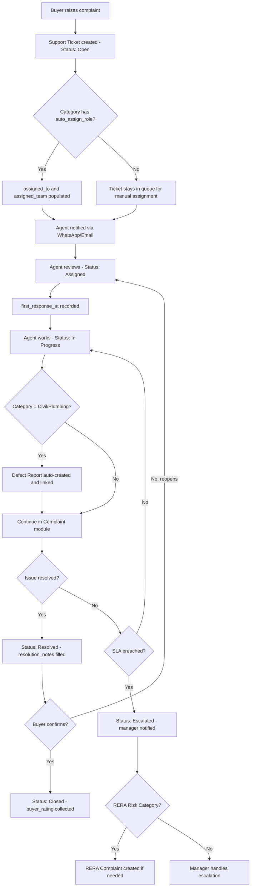

### Backend Processing

| Hook | Method | What Happens |
|---|---|---|
| `before_insert` | `sla_engine.set_sla_due_dates()` | Reads category → fetches default SLA policy → calculates `sla_response_due` and `sla_resolution_due` from current timestamp |
| `on_update` | `notifications.notify_buyer_status_change()` | Detects if `status` field changed; sends WhatsApp/email notification to buyer |
| `on_update` | `support_ticket.check_first_response()` | If status changes to "In Progress" or "Resolved" and `first_response_at` is empty, records the current datetime |
| `on_submit` | `support_ticket.create_defect_if_applicable()` | Checks if category maps to civil/plumbing; creates linked Defect Report automatically |
| Scheduler (30 min) | `sla_engine.check_sla_breaches()` | Scans all open tickets; if `sla_resolution_due < now`, sets `resolution_breached = 1` and fires `send_breach_alert()` |

### Database Interaction

**Primary DocTypes:**
- `Support Ticket` — Core transaction record (one per complaint)
- `Ticket Category` — Master that governs SLA defaults and routing
- `SLA Policy` — Master that defines response/resolution time targets

**Key Relationships:**
- `Support Ticket.category` → `Ticket Category`
- `Support Ticket.sla_policy` → `SLA Policy`
- `Support Ticket.buyer` → ERPNext `Contact`
- `Support Ticket.project` → ERPNext `Project`
- `Support Ticket.assigned_to` → ERPNext `User`
- `Support Ticket.assigned_team` → ERPNext `Department`
- `Support Ticket.defect_report` → `Defect Report` (cross-module link)
- `Support Ticket.rera_complaint` → `RERA Complaint` (cross-module link)

### APIs Used
- `buyer_portal/api.py::get_buyer_tickets()` — Returns all tickets for authenticated buyer
- `buyer_portal/api.py::create_ticket()` — Creates new ticket from portal form

### Validation Rules

| Rule | Field | Condition |
|---|---|---|
| Category required | `category` | Mandatory on save |
| Buyer required | `buyer` | Mandatory on save |
| Project required | `project` | Mandatory on save |
| Unit number required | `unit_no` | Mandatory on save |
| SLA auto-set | SLA fields | Calculated on `before_insert`; cannot be manually overridden below category default |
| Photo mandatory | Defect Item `photo` | Mandatory when severity = Major |

### Permissions & Roles

| Role | Create | Read | Edit | Delete | Submit |
|---|---|---|---|---|---|
| Support Manager | ✅ | ✅ All | ✅ All | ✅ | ✅ |
| Support Agent | ✅ | ✅ Own/Assigned | ✅ Assigned | ❌ | ❌ |
| Site Inspector | ❌ | ✅ Read-only | ❌ | ❌ | ❌ |
| Legal Team | ❌ | ✅ Read-only | ❌ | ❌ | ❌ |
| Buyer (Portal) | ✅ Own | ✅ Own only | ❌ | ❌ | ❌ |

### Notifications / Triggers

| Trigger | Channel | Recipient | Message |
|---|---|---|---|
| Ticket status changed | WhatsApp + Email | Buyer | "Your ticket {ticket_no} is now {status}" |
| SLA breach detected | WhatsApp + Email | Manager + Buyer (if configured) | "Ticket {ticket_no} SLA breached" |
| First response recorded | Internal only | Log only | — |
| Daily summary | Email | All Support Managers | Count of open/breached tickets |

### Error Handling

| Scenario | Behavior |
|---|---|
| SLA Policy not found on category | `set_sla_due_dates()` skips SLA calculation; ticket saved without SLA deadlines |
| WhatsApp API failure | `msgprint()` used as fallback; Portal Notification record created with `delivery_status = Failed` |
| Duplicate ticket creation | Naming series prevents duplicates; `frappe.DuplicateEntryError` caught at framework level |
| Buyer contact not found | Validation error on save — contact must exist in ERPNext |

### Dependencies

- Requires `Ticket Category` and `SLA Policy` masters to be configured before use
- Requires ERPNext `Project` and `Contact` records to exist
- Feeds into `Defect & Snagging` and `RERA Escalation` modules

---

## Module 2: Defect & Snagging

### Purpose
Manages the complete post-handover **punch-list process**. Site inspectors log defects per unit with photographs, area classification, and severity rating. Defects are assigned to contractors with due dates. A QC re-inspection confirms rectification. The buyer provides a **digital sign-off** on the completed report. All defect data feeds the project-wise defect heatmap.

### Functionalities
- Create defect inspection reports per unit per inspection type
- Log multiple defects per report with area, type, severity, and photo evidence
- Auto-assign contractors on submission
- Track contractor rectification progress per defect item
- QC re-inspection verification workflow
- Capture buyer digital signature on acceptance
- Auto-count open vs. completed defects
- Generate defect heatmap by project/tower/floor/unit

### User Actions

| User | Actions Available |
|---|---|
| Site Inspector | Create/edit defect reports; log defect items with photos; perform QC re-inspection |
| Support Manager | Review and approve defect reports; assign contractors; view heatmap report |
| Contractor (via agent) | Update defect item status to Done; upload rectification photos |
| Buyer | View own defect report (read-only via portal); sign digitally on acceptance |

### Workflow — Step by Step

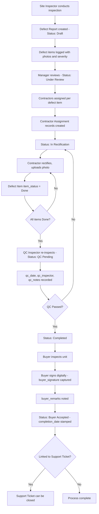

### Backend Processing

| Hook | Method | What Happens |
|---|---|---|
| `on_submit` | `assign_contractors_on_submit()` | Reads defect items; creates `Contractor Assignment` records grouped by contractor |
| `on_update` | `update_open_defect_count()` | Recalculates `open_defects` count from child table items with `item_status` not in (Done, Cannot Rectify) |

### Database Interaction

**DocTypes:**
- `Defect Report` — Parent transaction per inspection
- `Defect Item` — Child table (many defects per report)
- `Contractor Assignment` — Assignment tracking per contractor per report

**Key Relationships:**
- `Defect Report.project` → ERPNext `Project`
- `Defect Report.buyer` → ERPNext `Contact`
- `Defect Report.source_ticket` → `Support Ticket` (cross-module)
- `Defect Report.defects` → `Defect Item` (child table)
- `Defect Item.contractor` → ERPNext `Supplier`
- `Contractor Assignment.defect_report` → `Defect Report`
- `Contractor Assignment.purchase_order` → ERPNext `Purchase Order`

### Validation Rules

| Rule | Details |
|---|---|
| Photo mandatory for Major severity | `Defect Item.photo` required when `severity = Major` |
| QC cannot be done without all items assigned | Status transition blocked if items without contractors exist |
| Buyer signature required for acceptance | `buyer_signature` validated before status can reach "Buyer Accepted" |

### Naming Series
- Defect Report: `DEF-.YYYY.-.####` (e.g. `DEF-2026-0042`)
- Contractor Assignment: `CASS-.YYYY.-.####` (e.g. `CASS-2026-0015`)

### Dependencies
- `Defect Item` is a child table — only exists within `Defect Report`
- `Contractor Assignment` is created automatically on `Defect Report` submit
- `Supplier` master must be configured in ERPNext for contractor assignment
- Optionally links to ERPNext `Quality Inspection` for construction QC integration

---

## Module 3: Possession Management

### Purpose
Manages the **end-to-end legal and operational possession workflow**. This is the most cross-functional module, spanning Finance (dues clearance), Legal (NOC collection), Construction (OC availability), and the Possession Executive (scheduling and physical key handover). Six workflow states enforce strict sequential departmental sign-offs.

### Functionalities
- Initiate possession request (manually or from CRM booking)
- Auto-fetch outstanding financial dues
- Finance team due verification with audit trail
- Legal NOC checklist management (Bank NOC, Society NOC, Fire NOC, etc.)
- OC (Occupancy Certificate) attachment and verification
- Possession date scheduling and buyer confirmation
- Pre-possession unit inspection linking to Defect Report
- Physical key handover documentation with key count
- Welcome kit issuance and utility connections tracking
- Buyer digital signature capture at handover
- WhatsApp notification at every milestone

### Possession Request — 6-State Workflow

```mermaid
stateDiagram-v2
    [*] --> Initiated: Request created from CRM or manually
    Initiated --> DuesCheck: Finance verifies outstanding dues
    DuesCheck --> NOCCollection: Dues cleared confirmed (dues_cleared = Yes)
    NOCCollection --> Scheduled: All mandatory NOCs received + OC available
    Scheduled --> KeyHandover: Pre-inspection done; date confirmed by buyer
    KeyHandover --> Completed: Keys handed over; buyer signature captured
    KeyHandover --> [*]: Exception flow
    NOCCollection --> DuesCheck: NOC rejected; dues re-verification needed
```

### Step-by-Step Workflow

| Step | Actor | Action | System Trigger |
|---|---|---|---|
| 1 | CRM / Possession Exec | Create Possession Request | `outstanding_dues` fetched; Status = Initiated |
| 2 | Finance Team | Verify dues clearance | `dues_cleared = Yes`; `dues_verified_by` recorded; Status → Dues Check |
| 3 | Legal Team | Collect and mark NOC receipts | NOC Document child rows marked received |
| 4 | System | Check all mandatory NOCs | `check_all_nocs_received()` auto-sets `all_nocs_received = Yes` |
| 5 | Possession Exec | Upload OC; schedule date | `oc_copy` uploaded; `scheduled_date` confirmed; Status → Scheduled |
| 6 | Site Inspector | Pre-possession inspection | `pre_inspection_done` checked; any snags linked to Defect Report |
| 7 | Possession Exec | Physical key handover | `keys_count`, `handover_by`, `key_handover_date` recorded; Status → Key Handover |
| 8 | Buyer | Digital sign-off | `buyer_signature` captured; `welcome_kit_issued` checked |
| 9 | System | Complete possession | `utility_connections` confirmed; buyer receives WhatsApp; Status → Completed |

### Backend Processing

| Hook | Method | What Happens |
|---|---|---|
| `before_save` | `check_all_nocs_received()` | Scans NOC Document child table; if all mandatory NOCs have `received = Yes`, sets `all_nocs_received = Yes` |
| `on_update` | `notify_buyer_possession_update()` | Sends WhatsApp notification to buyer when status advances to next stage |
| Daily scheduler | `update_possession_aging()` | Calculates how many days each Possession Request has been stuck in current stage for aging report |

### NOC Document Child Table

| NOC Type | Issuing Authority | Mandatory? |
|---|---|---|
| Bank NOC | Financing bank | ✅ Yes |
| Society NOC | Housing society | ✅ Yes |
| Water Connection NOC | Municipal authority | ✅ Yes |
| Fire NOC | Fire department | ✅ Yes |
| Lift Inspection | Safety inspector | Depends on project type |
| Property Tax Clearance | Municipal body | ✅ Yes |

### Dependencies
- `Finance Team` role must verify dues before any NOC collection can begin
- `Legal Team` role manages all NOC tracking
- `Possession Exec` role orchestrates the handover event
- `Defect Report` may be linked for pre-possession snags
- ERPNext `Project` must be configured with OC status

---

## Module 4: RERA Escalation

### Purpose
Tracks formal complaints filed with state RERA authorities against the developer. This is the **highest-priority compliance module** — penalties can reach crore-scale amounts. The Legal team manages response preparation, hearing schedules, and outcome documentation. All penalty payments integrate with ERPNext Journal Entries.

### Functionalities
- Register RERA complaints with state RERA reference number
- Link to originating support ticket
- Track response deadlines with automated alerts
- Log every legal activity (hearings, filings, document submissions) in chronological response log
- Record settlement negotiations and outcome
- Integrate penalty payment with ERPNext Journal Entries
- Track appeal if developer contests the RERA order
- RERA Risk Dashboard: flag high-risk cases for management

### RERA Complaint Lifecycle

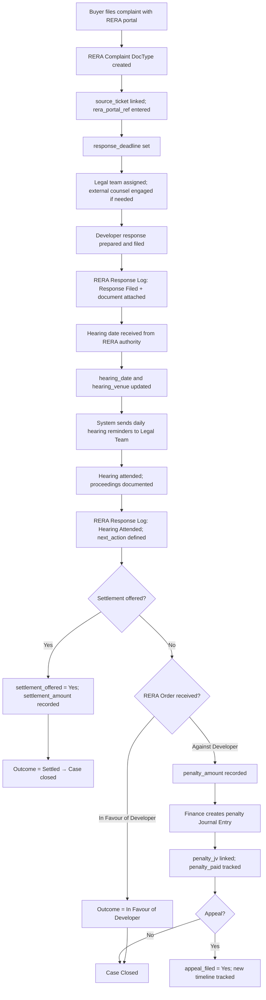

### Backend Processing

| Hook | Method | What Happens |
|---|---|---|
| `before_save` | `check_response_deadline()` | Checks if `response_deadline < today`; triggers urgent alert to legal team if overdue |
| `on_submit` | `notify_legal_team()` | Sends notification to assigned legal team member when complaint is formally submitted |
| Hourly scheduler | `rera_alert.check_response_deadlines()` | Scans all active RERA complaints; alerts if response deadlines are within 48 hours |
| Daily scheduler | `rera_alert.send_hearing_reminders()` | Sends hearing date reminders to Legal Team and external counsel |

### Database Interaction

**DocTypes:**
- `RERA Complaint` — Primary transaction (submittable)
- `RERA Response Log` — Child table (activity-by-activity log)

**Key Relationships:**
- `RERA Complaint.source_ticket` → `Support Ticket`
- `RERA Complaint.buyer` → ERPNext `Contact`
- `RERA Complaint.project` → ERPNext `Project`
- `RERA Complaint.legal_team` → ERPNext `User`
- `RERA Complaint.penalty_jv` → ERPNext `Journal Entry`
- `RERA Complaint.response_logs` → `RERA Response Log` (child table)

### Naming Series
- RERA Complaint: `RERA-.YYYY.-.####` (e.g. `RERA-2026-0007`)

### State RERA Selection Options
MahaRERA · RERA Karnataka · UP RERA · Gujarat RERA · Haryana RERA · Other (extensible via config)

### Dependencies
- Requires originating `Support Ticket` or manual creation
- `Journal Entry` must be created in ERPNext for penalty payment linkage
- External counsel name is text-only; no separate DocType for advocates

---

## Module 5: Buyer Portal

### Purpose
A Frappe **web portal** allowing buyers to self-serve without calling the support team. Buyers authenticate via mobile OTP, raise new complaints, track ticket status, view possession checklist progress, and review their unit's defect report. WhatsApp and email notifications keep buyers informed at every step.

### Functionalities
- Buyer login via mobile OTP (no password required)
- Raise new support tickets with attachments
- View real-time ticket status and SLA deadline
- View possession request status and scheduled handover date
- View defect report for owned unit (read-only)
- Receive WhatsApp/email notifications on all status changes
- Access support contact details (email, phone, office hours)
- Portal configuration controlled by `Buyer Portal Settings` (Single DocType)

### Portal Pages

| Page | URL Route | Template | Purpose |
|---|---|---|---|
| Portal Home | `/support` | `buyer_portal.html` | Welcome page; ticket list; raise new ticket |
| Ticket Detail | `/support/<ticket_no>` | `ticket_detail.html` | Full ticket detail; status history; add response |
| Possession Status | `/possession/<unit_no>` | `possession_status.html` | Stage-wise possession progress; handover date |

### API Methods

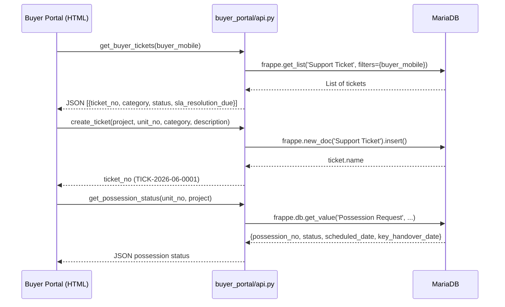

### Buyer Portal Settings (Single DocType)

Controls all portal features from one configuration screen accessible only to Support Manager:

| Setting | Type | Effect |
|---|---|---|
| `portal_enabled` | Checkbox | Master on/off switch for entire portal |
| `allow_ticket_create` | Checkbox | Enables/disables ticket creation from portal |
| `allowed_categories` | Multi-select | Which complaint categories buyers can use |
| `show_possession_status` | Checkbox | Shows/hides possession tracking page |
| `show_defect_report` | Checkbox | Shows/hides defect report page |
| `whatsapp_notify` | Checkbox | Enables WhatsApp notifications |
| `whatsapp_api_provider` | Select | Provider: Interakt / Wati / AiSensy / Gupshup |
| `buyer_auth_method` | Select | OTP via Mobile / Email OTP / Password |
| `session_timeout_mins` | Int | Auto-logout after inactivity (default: 30 min) |

### Portal Notification Log

Every notification dispatched (WhatsApp, Email, SMS, In-App) is recorded in the `Portal Notification` DocType with delivery status tracking.

- **Naming Series:** `PNOT-.YYYY.MM.DD.-.##`
- **Delivery States:** Sent → Delivered → Read / Failed
- **Failure Reason:** Captured for retry analysis

### Dependencies
- Requires `Buyer Portal Settings` to be configured with API keys
- Buyer must exist as ERPNext `Contact` with `is_buyer = Yes` custom field
- `website_route_rules` in `hooks.py` must be active for URL routing

---

## Module 6: Reports & Analytics

### Purpose
Provides operational intelligence across all modules. All reports are Frappe **Script Reports** (Python-based, SQL-safe). Dashboards use ERPNext Number Cards and Chart components. The Support Dashboard is the default home page for Support Managers.

### Report Inventory

| Report Name | Type | Key Filters | Business Value |
|---|---|---|---|
| SLA Breach Report | Script Report | Category, Period, Agent | Identify SLA failures; hold agents accountable |
| Ticket TAT by Category | Script Report | Category, Period, Priority | Benchmark resolution times; improve routing |
| Defect Heatmap by Unit | Script Report | Project, Tower, Floor, Period | Visual density of defects; target remediation |
| Possession Status Tracker | Script Report | Project, Status | Stage-wise possession pipeline aging |
| RERA Risk Dashboard | Script Report + Dashboard | Project, Category, Period | RERA exposure; penalty risk management |
| Agent Productivity Report | Script Report | Agent, Period, Team | Tickets closed, avg resolution, buyer ratings |
| Buyer Satisfaction Report | Script Report | Period, Project, Category | NPS tracking; satisfaction trends |
| Contractor Performance | Script Report | Contractor, Period, Project | On-time completion %; defaulted items |
| Support Dashboard | Dashboard (Live) | Date Range, Project | Real-time KPIs for management |

### Support Dashboard — Live KPIs

| KPI Card | Calculation |
|---|---|
| Open Tickets | `COUNT(Support Ticket WHERE status IN ('Open', 'Assigned', 'In Progress'))` |
| SLA Compliance % | `(Tickets resolved within SLA / Total closed) × 100` |
| Avg Resolution Time | `AVG(hours from creation to Closed status)` |
| RERA Active Cases | `COUNT(RERA Complaint WHERE outcome = 'Pending')` |
| Possession Pending | `COUNT(Possession Request WHERE status != 'Completed')` |
| Open Defects | `COUNT(Defect Item WHERE item_status IN ('Open', 'Assigned', 'In Progress'))` |

### Dashboard Charts

| Chart | Data Source | Visual Type |
|---|---|---|
| Open Tickets by Project | Support Ticket grouped by project | Bar Chart |
| SLA Compliance Rate (trend) | Support Ticket by week/month | Line Chart |

### Automation
- **Weekly**: `generate_weekly_kpi_report()` runs every Sunday to compile KPI summary
- **Export**: All reports exportable to Excel and PDF via standard Frappe export

---

# 4. End-to-End Business Process Flows

## 4.1 Buyer Complaint → Resolution Flow

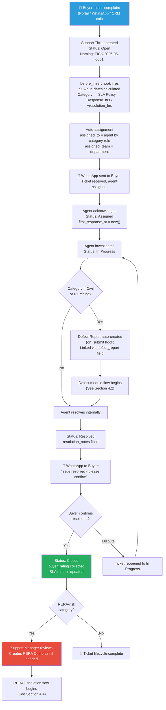

## 4.2 Defect Inspection → Buyer Acceptance Flow

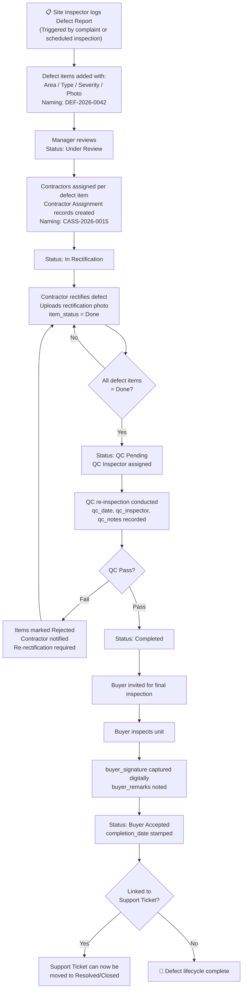

## 4.3 Possession Handover Flow

```mermaid
flowchart TD
    A["Possession Request initiated\n(from CRM or manually)\nNaming: POSS-2026-06-0088"] --> B["Status: Initiated\noutstanding_dues fetched\nfrom CRM/Finance"]
    B --> C["Finance Team verifies dues\ndues_cleared = Yes\ndues_verified_by recorded\nStatus: Dues Check"]
    C --> D["Legal Team collects NOCs\nNOC Document child rows updated\n(Bank NOC, Society NOC, Fire NOC, etc.)"]
    D --> E{"check_all_nocs_received()\nAll mandatory NOCs received?"}
    E --> |No| D
    E --> |Yes| F["all_nocs_received = Yes\nStatus: NOC Collection"]
    F --> G["OC received\noc_number and oc_copy uploaded\nStatus: Scheduled"]
    G --> H["Possession date scheduled\nscheduled_date confirmed\nBuyer receives WhatsApp confirmation"]
    H --> I["Pre-possession inspection\npre_inspection_done = Yes\nAny snags → Defect Report linked"]
    I --> J["Physical key handover conducted\nkeys_count recorded\nhandover_by (Possession Exec) noted\nStatus: Key Handover"]
    J --> K["Buyer provides digital signature\nwelcome_kit_issued checked\nwitness_name noted"]
    K --> L["Utility connections confirmed\nelectricity / water / gas status"]
    L --> M["Status: Completed\n📱 WhatsApp sent to Buyer:\n'Congratulations on your new home!'"]
    M --> N["Contact.possession_status auto-updated\n🏁 Possession lifecycle complete"]

    style A fill:#2D9CDB,color:#fff
    style M fill:#27AE60,color:#fff
```

## 4.4 RERA Escalation Flow

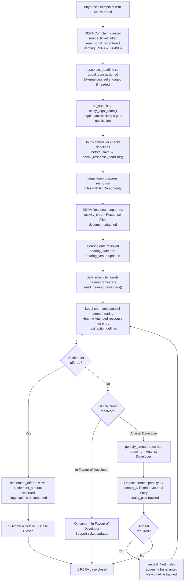

## 4.5 Buyer Self-Service Portal Journey

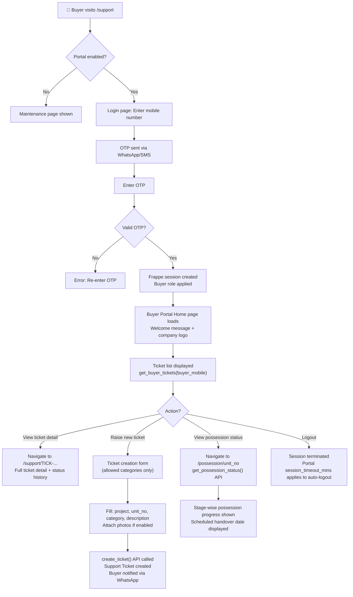

---

# 5. Role-Based System Flow

## 5.1 Role Definitions & Responsibilities

### Support Manager
- **Responsibilities:** Full system oversight, SLA policy configuration, escalation handling, KPI monitoring
- **Daily Activities:** Review Support Dashboard; handle escalated tickets; approve RERA decisions; review reports
- **Approval Authority:** Can delete documents; approve escalations; configure portal settings

### Support Agent
- **Responsibilities:** Day-to-day ticket management; buyer communication; complaint resolution
- **Daily Activities:** Process assigned tickets; update status; add resolution notes; liaise with inspectors
- **Restrictions:** Cannot access RERA module; cannot delete; cannot view possession module

### Site Inspector
- **Responsibilities:** Physical defect inspection; QC re-inspection; photo documentation
- **Daily Activities:** Create defect reports on mobile browser; log defect items on-site; perform QC checks
- **Restrictions:** Read-only on tickets; no access to RERA, Finance, possession settings

### Legal Team
- **Responsibilities:** RERA complaint management; response filing; hearing management; settlement negotiations
- **Daily Activities:** Update RERA case logs; file documents; monitor response deadlines; track hearing dates
- **Restrictions:** No access to finance details; can only edit NOC fields in Possession module

### Possession Executive
- **Responsibilities:** Full possession workflow orchestration; keys issuance; buyer sign-off
- **Daily Activities:** Update possession stages; coordinate with finance and legal; schedule handovers
- **Restrictions:** No access to RERA or Finance modules

### Finance Team
- **Responsibilities:** Dues verification in possession; RERA penalty JV posting
- **Daily Activities:** Verify financial dues on Possession Requests; create penalty Journal Entries
- **Restrictions:** Read-only on tickets; can only edit dues-related fields in Possession

### Buyer (Portal Role)
- **Responsibilities:** Self-service complaint creation and tracking
- **Access:** Own tickets only; own possession status; own defect report (read-only)
- **Restrictions:** No access to any admin module; cannot see other buyers' data

## 5.2 Role-Based Permission Matrix

| DocType | Support Mgr | Support Agent | Site Inspector | Legal Team | Possession Exec | Finance Team | Buyer |
|---|---|---|---|---|---|---|---|
| Support Ticket | Full / Submit | Own / Assigned | Read | Read | None | Read | Own Only |
| Ticket Category | Full | Read | None | None | None | None | None |
| SLA Policy | Full | Read | None | None | None | None | None |
| Defect Report | Full / Submit | Read | Full / Submit | Read | None | None | Read |
| Defect Item (child) | Full | Read | Full | Read | None | None | Read |
| Contractor Assignment | Full | Read | Full | None | None | None | None |
| Possession Request | Full | None | None | NOC only | Full | Dues fields only | Status only |
| NOC Document (child) | Full | None | None | Full | Full | None | None |
| Possession Checklist | Full | None | None | None | Read | None | None |
| RERA Complaint | Full | None | None | Full | None | None | None |
| RERA Response Log (child) | Full | None | None | Full | None | None | None |
| Buyer Portal Settings | Full | None | None | None | None | None | None |
| Portal Notification | Full | Read | None | None | None | None | Own |
| Reports (all modules) | Full | Limited (own) | Defect only | RERA only | Possession only | None | None |

## 5.3 Dashboard Visibility by Role

| Dashboard/Report | Support Mgr | Support Agent | Site Inspector | Legal | Possession Exec |
|---|---|---|---|---|---|
| Support Dashboard | ✅ Full | ✅ Own tickets | ❌ | ❌ | ❌ |
| SLA Breach Report | ✅ | ✅ Own | ❌ | ❌ | ❌ |
| Defect Heatmap | ✅ | ❌ | ✅ | ❌ | ✅ read |
| RERA Risk Dashboard | ✅ | ❌ | ❌ | ✅ | ❌ |
| Possession Tracker | ✅ | ❌ | ❌ | ✅ read | ✅ |
| Agent Productivity | ✅ | ✅ Own | ❌ | ❌ | ❌ |
| Contractor Performance | ✅ | ❌ | ✅ | ❌ | ❌ |

---

# 6. Database & Data Flow Understanding

## 6.1 Core Entities / Models

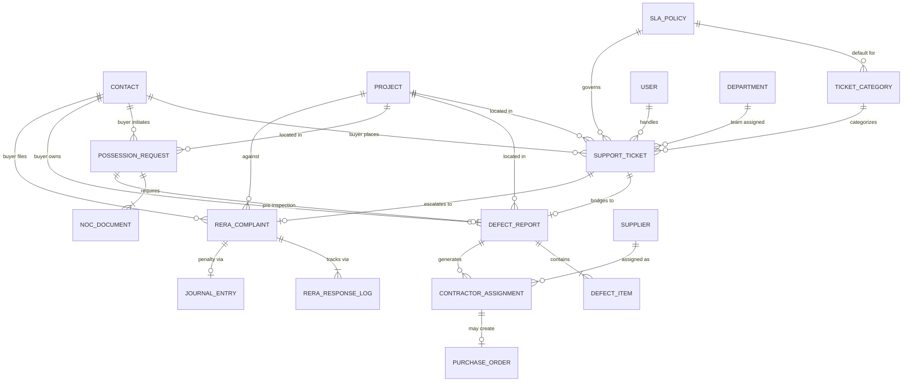

## 6.2 Data Lifecycle

### Support Ticket Lifecycle

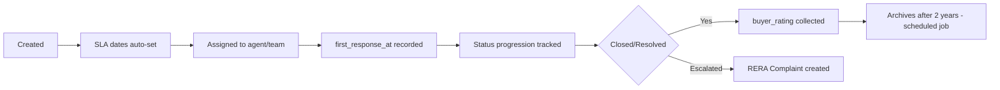

### Defect Item Lifecycle

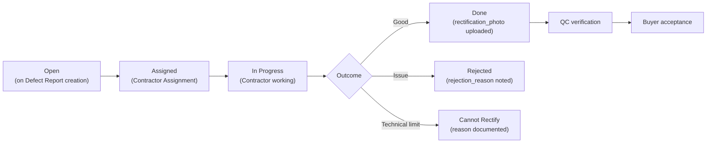

## 6.3 Naming Series Configuration

| DocType | Naming Pattern | Example |
|---|---|---|
| Support Ticket | `TICK-.YYYY.MM.-.####` | `TICK-2026-06-0001` |
| Defect Report | `DEF-.YYYY.-.####` | `DEF-2026-0042` |
| Possession Request | `POSS-.YYYY.MM.-.####` | `POSS-2026-06-0088` |
| RERA Complaint | `RERA-.YYYY.-.####` | `RERA-2026-0007` |
| Contractor Assignment | `CASS-.YYYY.-.####` | `CASS-2026-0015` |
| Portal Notification | `PNOT-.YYYY.MM.DD.-.##` | `PNOT-2026-06-15-03` |

## 6.4 ERPNext Custom Fields (Non-invasive Extensions)

All extensions to ERPNext core DocTypes use `fixtures/custom_fields.json` — zero core file modifications.

| ERPNext DocType | Custom Field | Type | Purpose |
|---|---|---|---|
| Contact | `unit_no` | Data | Buyer's flat/unit number |
| Contact | `project` | Link → Project | Buyer's real estate project |
| Contact | `booking_ref` | Data | CRM booking reference |
| Contact | `possession_status` | Data (read-only) | Auto-updated current possession stage |
| Contact | `is_buyer` | Check | Marks contact as a real estate buyer |
| Project | `rera_registration_no` | Data | RERA project registration number |
| Project | `oc_received` | Check | Occupancy Certificate received flag |
| Project | `project_type` | Select | Apartment / Villa / Commercial / Plotted |
| Project | `total_units` | Int | Total sellable units |
| Purchase Order | `defect_report` | Link → Defect Report | Traces PO to rectification batch |
| Journal Entry | `rera_complaint` | Link → RERA Complaint | Traces penalty JV to RERA case |

## 6.5 Data Movement Across Modules

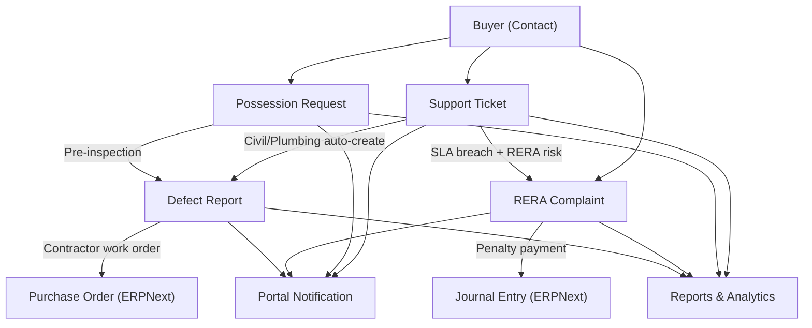

---

# 7. API & Service Flow

## 7.1 API Architecture

RSS uses two categories of APIs:

1. **Frappe whitelisted methods** — Decorated with `@frappe.whitelist()`, callable via AJAX from portal pages. Session-authenticated using Frappe cookies. **No unauthenticated (guest) access allowed.**

2. **Frappe doc event hooks** — Not external APIs; internal Python methods triggered by the framework lifecycle (before_insert, on_update, on_submit, etc.).

## 7.2 Portal API Endpoints

| Method | Endpoint | Auth | Input Parameters | Returns |
|---|---|---|---|---|
| `get_buyer_tickets` | `/api/method/re_support.buyer_portal.api.get_buyer_tickets` | Session (Buyer role) | `buyer_mobile` | List of `{ticket_no, category, status, sla_resolution_due, priority}` |
| `create_ticket` | `/api/method/re_support.buyer_portal.api.create_ticket` | Session (Buyer role) | `project, unit_no, category, description, attachments?` | `ticket_name` (string) |
| `get_possession_status` | `/api/method/re_support.buyer_portal.api.get_possession_status` | Session (Buyer role) | `unit_no, project` | `{possession_no, status, scheduled_date, key_handover_date}` |

## 7.3 Request Lifecycle

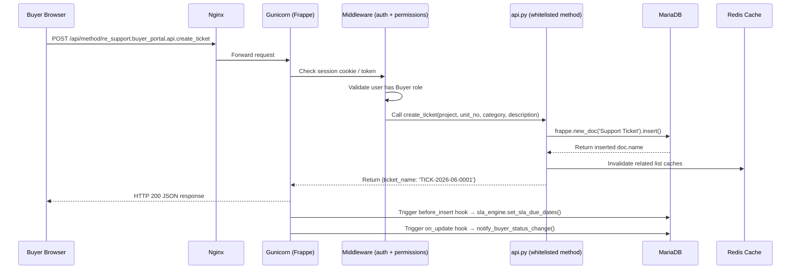

## 7.4 External Service Integration

| Service | Provider Options | Integration Point | API Key Storage |
|---|---|---|---|
| WhatsApp Messaging | Interakt / Wati / AiSensy / Gupshup | `utils/notifications.py` | `Buyer Portal Settings.whatsapp_api_key` (Password field, encrypted) |
| Email (SMTP) | Any SMTP / Frappe Email Domain | `frappe.sendmail()` in notifications.py | Frappe Email Domain configuration |
| SMS (OTP) | Configured in Frappe | Portal buyer authentication | Frappe SMS settings |

## 7.5 Response Structures

**Success Response:**
```json
{
  "message": "TICK-2026-06-0001"
}
```

**Error Response (validation):**
```json
{
  "exc_type": "ValidationError",
  "exception": "re_support.exceptions.ValidationError: Category is mandatory",
  "exc": "...",
  "_server_messages": "[{\"message\": \"Category is mandatory\"}]"
}
```

**Permission Error:**
```json
{
  "exc_type": "PermissionError",
  "exception": "frappe.exceptions.PermissionError: Not permitted"
}
```

---

# 8. UI / Screen Flow Documentation

## 8.1 ERPNext Desk Navigation Tree

```
ERPNext Home Screen
└── RE Support Workspace
    ├── Complaint Management Module
    │   ├── Support Ticket [List] → New
    │   ├── Ticket Category [List] → New
    │   ├── SLA Policy [List] → New
    │   ├── SLA Breach Report [Report]
    │   └── Ticket TAT by Category [Report]
    ├── Defect & Snagging Module
    │   ├── Defect Report [List] → New
    │   ├── Contractor Assignment [List]
    │   └── Defect Heatmap by Unit [Report]
    ├── Possession Management Module
    │   ├── Possession Request [List] → New
    │   ├── Possession Checklist [List]
    │   └── Possession Status Tracker [Report]
    ├── RERA Escalation Module
    │   ├── RERA Complaint [List] → New
    │   └── RERA Risk Dashboard [Report/Dashboard]
    ├── Buyer Portal Module
    │   ├── Buyer Portal Settings [Single DocType]
    │   └── Portal Notification [List]
    └── Reports & Analytics Module
        ├── Support Dashboard [Dashboard]
        ├── Agent Productivity Report [Report]
        ├── Buyer Satisfaction Report [Report]
        └── Contractor Performance Report [Report]
```

## 8.2 Support Ticket Form — Screen Description

| Section | Components | User Interactions |
|---|---|---|
| Header | ticket_no (auto), status badge, priority flag | Read-only; status can be changed by authorized roles |
| Buyer Info | buyer (Link), buyer_mobile (auto-fetch), project (Link), unit_no, tower_block, floor_no | Select Contact → mobile fetches automatically; select Project |
| Complaint Details | category (Link), sub_category, priority, description (Rich Text), attachments | Category selection triggers SLA auto-population on backend |
| SLA Information | sla_policy, sla_response_due, sla_resolution_due, first_response_at, response_breached, resolution_breached | Auto-calculated; read-only |
| Assignment | assigned_to (User Link), assigned_team (Department Link) | Auto-filled by category; can be overridden by Support Manager |
| Resolution | resolution_notes, closed_at, buyer_rating (1–5 stars), buyer_feedback | Filled by agent on resolution; rating submitted by buyer |
| Cross-Module Links | defect_report (Link), rera_complaint (Link) | Auto-populated by system; navigates to linked DocType |
| Internal | internal_notes, escalation_reason | Agent-only fields; not visible to buyer |

## 8.3 Buyer Portal Screens — Screen Description

### Portal Home (`/support`)
- **Header:** Company logo + welcome message from `Buyer Portal Settings`
- **Components:** Ticket summary cards (ticket_no, category, status, SLA deadline), "Raise New Ticket" button
- **Interactions:** Click ticket card → navigates to `/support/<ticket_no>`; click "Raise New Ticket" → inline form

### Ticket Detail (`/support/<ticket_no>`)
- **Components:** Full ticket fields visible to buyer; status timeline; resolution notes (if resolved)
- **Interactions:** Buyer can add response/confirmation; view attachment photos

### Possession Status (`/possession/<unit_no>`)
- **Components:** Stage indicator (Initiated → Dues Check → NOC → Scheduled → Key Handover → Completed); scheduled date; handover details
- **Interactions:** Read-only; auto-refreshes on status change

## 8.4 Mobile-Optimized Views

Site Inspectors use mobile browser for on-site defect logging. The Defect Report form is designed for mobile use:
- Large photo upload button for `photo` field
- Simplified area selection (dropdown)
- Offline-friendly (Frappe's PWA capabilities)

---

# 9. Automation & Background Process Flow

## 9.1 Scheduler Overview

All scheduled jobs are defined in `hooks.py` under `scheduler_events`.

```mermaid
gantt
    title Scheduler Event Timeline
    dateFormat HH:mm
    section Every 30 Minutes
    SLA Breach Check         : 00:00, 30m
    SLA Breach Check         : 00:30, 30m
    section Every Hour
    RERA Deadline Check      : 00:00, 60m
    section Daily (midnight)
    SLA Summary to Managers  : 00:00, 5m
    Hearing Reminders        : 00:05, 5m
    Possession Aging Update  : 00:10, 5m
    section Weekly (Sunday)
    Weekly KPI Report Gen    : 00:00, 15m
```

## 9.2 Scheduled Job Details

### Every 30 Minutes: `sla_engine.check_sla_breaches()`

**Purpose:** Proactive SLA breach detection and escalation

**Logic:**
1. Query all `Support Ticket` where `status IN ('Open', 'Assigned', 'In Progress')`
2. For each ticket, compare `sla_resolution_due` against `now()`
3. If `sla_resolution_due < now` → set `resolution_breached = 1`
4. If `escalate_to` is populated → call `send_breach_alert(ticket, user)`
5. Commit transaction

**Business Impact:** Ensures no ticket silently breaches SLA; enables proactive intervention

### Every Hour: `rera_alert.check_response_deadlines()`

**Purpose:** Enforce legal compliance for RERA response deadlines

**Logic:** Scans all active RERA Complaints; alerts legal team if `response_deadline` is within 48 hours

### Daily: `notifications.send_daily_sla_summary_to_managers()`

**Purpose:** Morning briefing for Support Managers

**Logic:** Counts all `Support Ticket` where `resolution_breached = 1` and `status != 'Closed'`; sends summary if count > 0

### Daily: `rera_alert.send_hearing_reminders()`

**Purpose:** Prevent missed RERA hearings

**Logic:** Finds all `RERA Complaint` with `hearing_date = tomorrow`; sends WhatsApp + email to `legal_team` and `external_counsel`

### Daily: `possession_management.tasks.update_possession_aging()`

**Purpose:** Aging analysis for Possession Status Tracker report

**Logic:** Calculates days elapsed since each status transition for all active Possession Requests; stores aging data for report queries

### Weekly: `reports_analytics.tasks.generate_weekly_kpi_report()`

**Purpose:** Executive KPI report every Sunday

**Logic:** Compiles previous week's ticket metrics (open, closed, SLA compliance, avg resolution time) and emails to Support Managers

## 9.3 Document Event Hooks Summary

```mermaid
graph TD
    A["Support Ticket\nbefore_insert"] --> B["set_sla_due_dates()\n→ Auto-calculate SLA deadlines"]
    C["Support Ticket\non_update"] --> D["notify_buyer_status_change()\n→ WhatsApp/Email to buyer"]
    C --> E["check_first_response()\n→ Record first_response_at"]
    F["Support Ticket\non_submit"] --> G["create_defect_if_applicable()\n→ Auto-create Defect Report"]
    H["Defect Report\non_submit"] --> I["assign_contractors_on_submit()\n→ Create Contractor Assignment records"]
    J["Defect Report\non_update"] --> K["update_open_defect_count()\n→ Recalculate open_defects counter"]
    L["Possession Request\nbefore_save"] --> M["check_all_nocs_received()\n→ Auto-set all_nocs_received flag"]
    N["Possession Request\non_update"] --> O["notify_buyer_possession_update()\n→ WhatsApp milestone notification"]
    P["RERA Complaint\nbefore_save"] --> Q["check_response_deadline()\n→ Alert if deadline overdue"]
    R["RERA Complaint\non_submit"] --> S["notify_legal_team()\n→ Urgent legal team notification"]
```

## 9.4 Notification Automation Flow

```mermaid
flowchart TD
    A["Status change event\n(on_update hook)"] --> B["notify_buyer_status_change(doc)"]
    B --> C{"doc.has_value_changed('status')?"}
    C --> |No| D["Exit - no notification needed"]
    C --> |Yes| E["Build notification subject and message"]
    E --> F{"whatsapp_notify enabled\nin Buyer Portal Settings?"}
    F --> |Yes| G["Call WhatsApp API provider\n(Interakt/Wati/AiSensy)"]
    G --> H{"API call success?"}
    H --> |Success| I["Portal Notification record: Sent"]
    H --> |Failure| J["Portal Notification record: Failed\nfailure_reason recorded\nfrappe.log_error() called"]
    F --> |No| K{"email_notify enabled?"}
    K --> |Yes| L["frappe.sendmail()\nusing email_notify_template"]
    K --> |No| M["No notification sent"]
    L --> I
```

---

# 10. Reports & Analytics Flow

## 10.1 Report Generation Logic

All reports are **Frappe Script Reports** — Python scripts that generate data dynamically with parameterized SQL queries via `frappe.db.sql()` or `frappe.get_list()`.

```mermaid
flowchart TD
    A["User opens report\n(e.g. SLA Breach Report)"] --> B["Report filter form shown\n(Category, Period, Agent)"]
    B --> C["User sets filters and clicks Run"]
    C --> D["Frappe calls report's get_data(filters) method"]
    D --> E["Python script queries MariaDB\nusing frappe.db.sql() or frappe.get_list()"]
    E --> F["Data returned as list of dicts"]
    F --> G["Frappe renders as sortable table"]
    G --> H{"Export required?"}
    H --> |Excel| I["Download .xlsx file"]
    H --> |PDF| J["Print format applied → PDF download"]
    H --> |No| K["View in browser"]
```

## 10.2 SLA Breach Report Logic

**Data Source:** `Support Ticket`

**Key Calculation:**
```
breach_duration_hrs = (now() - sla_resolution_due) in hours WHERE resolution_breached = 1
```

**Filters:** `category`, `date_range`, `assigned_to`

**Columns:** ticket_no, buyer, project, category, priority, sla_resolution_due, breach_duration_hrs, assigned_to, status

## 10.3 Defect Heatmap by Unit

**Data Source:** `Defect Item` joined to `Defect Report`

**Key Calculation:**
```
defect_density_per_unit = COUNT(Defect Item) GROUP BY project + tower_block + floor_no + unit_no
```

**Visual:** Grid representation (tower × floor × unit) with color density based on defect count

## 10.4 RERA Risk Score

**Data Source:** `Support Ticket` + `RERA Complaint`

**Risk Score Logic:**
```
risk_score = (open_rera_cases × 10) + (rera_risk_tickets_unresolved × 3) + (penalty_exposure_amount / 100000)
```

**Output:** Project-wise risk ranking for management attention

## 10.5 Agent Productivity Report

**Data Source:** `Support Ticket`

**Key Metrics:**
- Tickets closed per agent per period
- Average resolution time (hours)
- Average buyer rating (1–5)
- SLA compliance % per agent

## 10.6 Dashboard Charts

| Chart | Data Source | Aggregation | Visual |
|---|---|---|---|
| Open Tickets by Project | Support Ticket | COUNT grouped by project | Bar chart |
| SLA Compliance Rate | Support Ticket | % within SLA by week | Line chart (trend) |

---

# 11. Security & Access Control Flow

## 11.1 Authentication Architecture

```mermaid
flowchart TD
    A["Login Request"] --> B{"User type?"}
    B --> |ERPNext Internal User| C["Standard Frappe Login\nUsername + Password"]
    B --> |Buyer Portal| D["Mobile OTP Flow"]
    C --> E["bcrypt password verification"]
    E --> F{"Valid?"}
    F --> |Yes| G["Frappe session cookie created\nstored in Redis"]
    F --> |No| H["Account lockout after\nconfigured failed attempts"]
    G --> I["Roles loaded: Support Manager,\nSupport Agent, Site Inspector, etc."]
    I --> J["Permission matrix applied to\nevery DocType access"]
    D --> K["OTP generated (6-digit)\nsent via SMS/WhatsApp"]
    K --> L["OTP verified\n(time-limited, single-use)"]
    L --> M["Frappe portal session created\nBuyer role applied"]
    M --> N["Session timeout: session_timeout_mins\n(default: 30 min, auto-logout)"]
```

## 11.2 Role-Based Access Control (RBAC)

Frappe's built-in permission system enforces access at multiple levels:

| Level | Mechanism | Example |
|---|---|---|
| DocType level | Permission rules per role | Buyer role cannot read SLA Policy |
| Document level | `user_permissions` / role restrictions | Buyers see only own tickets via filtered queries |
| Field level | Field permissions | `internal_notes` hidden from Buyer role |
| Report level | Report permissions | RERA Risk Dashboard restricted to Legal + Manager |

## 11.3 Data Isolation — Buyer Portal

```python
# Buyer can only see own tickets
frappe.get_list('Support Ticket',
    filters={'buyer_mobile': buyer_mobile},  # Filters to authenticated buyer's mobile
    fields=[...],
    order_by='creation desc')
# frappe.whitelist(allow_guest=False) ensures no unauthenticated access
```

## 11.4 API Key Security

- WhatsApp API key stored in `Buyer Portal Settings.whatsapp_api_key` as **Password field** (Frappe stores this encrypted in the database)
- Never exposed in API responses
- HTTPS enforced at Nginx layer in production

## 11.5 Session Management

| Setting | Value | Effect |
|---|---|---|
| Portal session timeout | `session_timeout_mins` (configurable, default 30) | Auto-logout inactive buyers |
| ERPNext session | Frappe default (24 hours) | Standard internal user session |
| OTP validity | Frappe default (10 minutes) | Single-use, time-limited OTPs |

## 11.6 Fixtures & Configuration Security

- All roles exported as `fixtures/roles.json` — versions controlled in Git
- Custom fields exported as `fixtures/custom_fields.json` — no manual DB edits needed
- Permission matrix applied via Frappe's standard Role Permission Manager UI

---

# 12. Error Handling & Exception Flow

## 12.1 Validation Errors

| Error Type | Trigger | User-Facing Message | System Action |
|---|---|---|---|
| Missing mandatory field | Save without required field | "Category is mandatory" | Frappe shows inline error; save blocked |
| Invalid link reference | Selecting non-existent Buyer/Project | "Invalid link: Contact does not exist" | Save blocked |
| SLA Policy not found | Category has no default_sla | Silent skip — SLA dates not set | Ticket saved without SLA dates; manager can set manually |
| Duplicate naming | Race condition on series | Auto-incremented by Frappe | Framework handles transparently |

## 12.2 API Failure Flow

```mermaid
flowchart TD
    A["API call: create_ticket()"] --> B{"Session valid?"}
    B --> |No| C["Return PermissionError\nHTTP 403"]
    B --> |Yes| D{"Required fields\npresent?"}
    D --> |No| E["Return ValidationError\nHTTP 417"]
    D --> |Yes| F["frappe.new_doc().insert()"]
    F --> G{"DB write success?"}
    G --> |Yes| H["Return ticket_name\nHTTP 200"]
    G --> |No: DB error| I["frappe.log_error() called\nReturn InternalServerError\nHTTP 500"]
    I --> J["Error logged in\nFrappe Error Log DocType"]
```

## 12.3 WhatsApp Notification Failure

When WhatsApp delivery fails:
1. `Portal Notification` record created with `delivery_status = Failed`
2. `failure_reason` field populated with API error message
3. `frappe.log_error()` writes to Frappe's Error Log
4. Fallback to email notification (if `email_notify = Yes`)
5. Support Manager can view failed notifications for manual follow-up

## 12.4 SLA Engine Error Handling

```python
def check_sla_breaches():
    """Robust: even if one ticket fails, others processed"""
    open_tickets = frappe.get_list(...)
    for ticket in open_tickets:
        try:
            if ticket.sla_resolution_due and ticket.sla_resolution_due < now:
                frappe.db.set_value(...)
        except Exception as e:
            frappe.log_error(f"SLA breach check failed for {ticket.name}: {e}")
    frappe.db.commit()  # Single commit after all updates
```

## 12.5 User-Facing Error Messages

| Scenario | Message Shown to User |
|---|---|
| Portal ticket creation fails | "Unable to create ticket. Please try again or contact support at {support_phone}" |
| OTP expired/invalid | "OTP is invalid or has expired. Please request a new OTP." |
| Session timeout | "Your session has expired. Please login again." |
| Permission denied | "You do not have permission to access this resource." |

## 12.6 Logging System

| Log Type | Location | Retention |
|---|---|---|
| Application errors | Frappe `Error Log` DocType | 30 days (configurable) |
| Scheduler errors | `frappe.log_error()` → Error Log | 30 days |
| Notification failures | `Portal Notification.failure_reason` | Permanent (in DocType) |
| SLA breach events | `Support Ticket.resolution_breached` flag | Permanent (in DocType) |
| Access logs | Nginx access log | Server-level retention |

---

# 13. Integration Flow

## 13.1 ERPNext Core Integration Map

```mermaid
graph LR
    subgraph re_support
        ST[Support Ticket]
        DR[Defect Report]
        PR[Possession Request]
        RC[RERA Complaint]
        BP[Buyer Portal]
    end

    subgraph ERPNext Core
        CON[Contact / Customer\n(CRM)]
        PRJ[Project\n(Projects)]
        SUP[Supplier\n(Buying)]
        PO[Purchase Order\n(Buying)]
        JE[Journal Entry\n(Accounts)]
        USR[User / Department\n(HR)]
        SI[Sales Invoice\n(Accounts)]
    end

    ST --> |buyer Link| CON
    ST --> |project Link| PRJ
    ST --> |assigned_to / assigned_team| USR
    DR --> |buyer Link| CON
    DR --> |project Link| PRJ
    DR --> |contractor Link (via Defect Item)| SUP
    DR --> |generates| PO
    PO --> |defect_report custom field| DR
    PR --> |buyer Link| CON
    PR --> |project Link| PRJ
    PR --> |dues verification Finance| SI
    RC --> |buyer Link| CON
    RC --> |project Link| PRJ
    RC --> |penalty_jv Link| JE
    JE --> |rera_complaint custom field| RC
    BP --> |authenticates via| CON
```

## 13.2 CRM / Contact Integration

- **Buyers modelled as ERPNext Contacts** (linked to Customer if needed)
- **Custom fields on Contact:** `unit_no`, `project`, `booking_ref`, `possession_status`, `is_buyer`
- `buyer_mobile` and `buyer_email` auto-fetched from Contact on selection in any DocType
- `possession_status` on Contact auto-updated when Possession Request advances stages

## 13.3 Finance Integration

| Integration | DocType | ERPNext DocType | Purpose |
|---|---|---|---|
| RERA penalty payment | RERA Complaint.penalty_jv | Journal Entry | Penalty accounting |
| Contractor payment | Contractor Assignment.purchase_order | Purchase Order | Rectification work contracts |
| Possession dues | Possession Request.outstanding_dues | Sales Invoice | Outstanding amount query |
| Support cost tracking | All tickets | Cost Centers per Project | Project-wise cost attribution |

## 13.4 WhatsApp Integration Architecture

```mermaid
flowchart TD
    A["Doc event: on_update\nstatus changed"] --> B["notify_buyer_status_change(doc)"]
    B --> C["Build message from template\n'Ticket {ticket_no} is now {status}'"]
    C --> D["Read Buyer Portal Settings\nwhatsapp_api_provider\nwhatsapp_api_key"]
    D --> E{"Provider?"}
    E --> |Interakt| F["POST to Interakt API\n/v1/send/whatsapp"]
    E --> |Wati| G["POST to Wati API\n/api/v1/sendTemplateMessage"]
    E --> |AiSensy| H["POST to AiSensy API\n/campaign/send"]
    E --> |Custom| I["POST to custom webhook URL"]
    F --> J["Log Portal Notification\ndelivery_status = Sent/Failed"]
    G --> J
    H --> J
    I --> J
```

## 13.5 Email Integration

- Uses Frappe's native email system (`frappe.sendmail()`)
- Email templates configurable per `Ticket Category` (category-specific templates)
- Default template set in `Buyer Portal Settings.email_notify_template`
- SMTP configuration managed at Frappe site level (not in-app)

## 13.6 Quality Module Integration

- `Defect Report` can optionally link to ERPNext `Quality Inspection` DocType
- Enables QC parameters to mirror RERA complaint categories for compliance tracking
- Provides construction QC → support handover data trail

---

# 14. Complete System Flow Summary

## 14.1 Overall Workflow Summary

The RE Support System operates as a **closed-loop post-handover support ecosystem**:

```mermaid
flowchart LR
    A["🧑‍💼 Buyer\nComplaint"] --> B["📋 Complaint\nManagement\n(SLA tracking)"]
    B --> |"Civil/Plumbing issue"| C["🔧 Defect &\nSnagging\n(Rectification)"]
    B --> |"Legal risk"| D["⚖️ RERA\nEscalation\n(Compliance)"]
    E["🏠 Possession\nRequest"] --> F["Finance: Dues\nLegal: NOCs\nExec: Handover"]
    F --> C
    B --> G["🌐 Buyer\nPortal\n(Self-service)"]
    C --> G
    E --> G
    B --> H["📊 Reports &\nAnalytics\n(Intelligence)"]
    C --> H
    E --> H
    D --> H

    style A fill:#2980B9,color:#fff
    style H fill:#8E44AD,color:#fff
```

## 14.2 Inter-Module Communication Summary

| Source → Target | Trigger | Data Passed |
|---|---|---|
| Complaint Management → Defect & Snagging | Civil/plumbing ticket submitted | source_ticket reference; project; unit_no; buyer |
| Complaint Management → RERA Escalation | SLA breach + RERA-risk category | source_ticket reference; buyer; project; complaint details |
| Defect & Snagging → Possession Management | Pre-possession inspection | defect_report reference |
| All modules → Buyer Portal | Status change events | Notifications pushed via WhatsApp/Email |
| All modules → Reports & Analytics | All DocType data | Aggregated by scheduled jobs and on-demand reports |
| RERA Escalation → ERPNext Accounts | Penalty outcome | Journal Entry auto-linked |
| Defect & Snagging → ERPNext Buying | Contractor assignment | Purchase Order created |

## 14.3 Business Operation Summary

| Business Outcome | Modules Involved | Key Automation |
|---|---|---|
| Complaint resolved within SLA | Complaint Management | SLA engine every 30 min; auto-escalation |
| Defect rectified with buyer sign-off | Complaint + Defect & Snagging | Auto defect creation; contractor assignment on submit |
| Possession handed over legally | Possession Management + Finance + Legal | Sequential workflow; NOC checker; buyer notification at each stage |
| RERA case managed without penalty | RERA Escalation | Hourly deadline checks; daily hearing reminders |
| Buyer self-served without calling | Buyer Portal | Portal APIs; OTP login; real-time ticket status |
| Weekly KPI report for management | Reports & Analytics | Weekly scheduled report generation |

## 14.4 Key Automation Summary

| Automation | Trigger | Frequency | Business Value |
|---|---|---|---|
| SLA deadline auto-set | `before_insert` (ticket creation) | Every new ticket | Ensures every ticket has measurable SLA target |
| Buyer WhatsApp notification | `on_update` (status change) | Every status change | Real-time transparency; reduces inbound calls |
| SLA breach detection | Cron every 30 minutes | 48×/day | Proactive escalation; prevents ignored tickets |
| RERA deadline alert | Cron every hour | 24×/day | Legal compliance; prevents response default |
| NOC auto-flag | `before_save` (possession) | Every possession save | Prevents premature possession approval |
| Defect auto-creation | `on_submit` (ticket) | Civil/plumbing tickets | Ensures no defect complaint falls through cracks |
| Contractor auto-assignment | `on_submit` (defect report) | Every defect submission | Immediate action; no manual assignment delay |
| Daily SLA summary | Daily cron | Once/day | Morning briefing for managers |
| Possession aging update | Daily cron | Once/day | Aging analytics for pending possessions |
| Weekly KPI report | Weekly cron | Once/week | Executive performance reporting |

## 14.5 Critical Dependencies

```mermaid
graph TD
    A["ERPNext v15+ installed\n(required_apps in hooks.py)"] --> B["re_support app installed"]
    C["Ticket Category masters\nconfigured with SLA Policy"] --> D["Support Tickets\ncan be raised"]
    E["SLA Policy masters\nconfigured with hours"] --> D
    F["Buyer Portal Settings\nconfigured with WhatsApp API key"] --> G["WhatsApp notifications\nwork"]
    H["Contact records\n(Buyers) exist with is_buyer = Yes"] --> I["Portal login\nand ticket creation work"]
    J["ERPNext Project records\nexist per development"] --> D
    J --> K["Possession Requests\ncan be raised"]
    K --> L["Finance dues clearance\n(first gate)"]
    L --> M["NOC collection\n(second gate)"]
    M --> N["Key handover\ncan proceed"]
```

## 14.6 Scalability Considerations

| Consideration | Current Approach | Scaling Path |
|---|---|---|
| Multi-project support | `project` Link field on all DocTypes | All reports and dashboards filter by project; supports unlimited projects |
| WhatsApp provider | Abstracted in `utils/notifications.py` | Swap provider by changing `Buyer Portal Settings.whatsapp_api_provider` — no code change |
| State RERA | Select field (configurable) | Add new RERA states via `Property Setter` fixture — no code change |
| Contractor portal | Not in scope v1 | Future: separate contractor login role + portal pages |
| Data archival | Scheduled job archiving tickets >2 years | Reduces main table size; queries remain fast |
| Report performance | Frappe Script Reports (Python + SQL) | Move heavy aggregations to Data Warehouse if team exceeds 10k tickets/month |
| Multi-site | ERPNext multi-site bench | Deploy RSS on multiple ERPNext sites (one per region/entity) |

## 14.7 Server Requirements Summary

| Component | Minimum | Recommended |
|---|---|---|
| OS | Ubuntu 20.04 LTS | Ubuntu 22.04 LTS |
| Python | 3.10+ | 3.11+ |
| Node.js | 18.x | 20.x LTS |
| MariaDB | 10.6+ | 10.11+ |
| Redis | 6.x | 7.x |
| RAM | 8 GB | 16 GB |
| Disk | 50 GB SSD | 200 GB SSD |
| ERPNext | v15.0 | v15 latest |
| Frappe | v15.0 | v15 latest |

---

# Appendix A: Naming Series Reference

| DocType | Naming Pattern | Example Output |
|---|---|---|
| Support Ticket | `TICK-.YYYY.MM.-.####` | `TICK-2026-06-0001` |
| Defect Report | `DEF-.YYYY.-.####` | `DEF-2026-0042` |
| Possession Request | `POSS-.YYYY.MM.-.####` | `POSS-2026-06-0088` |
| RERA Complaint | `RERA-.YYYY.-.####` | `RERA-2026-0007` |
| Contractor Assignment | `CASS-.YYYY.-.####` | `CASS-2026-0015` |
| Portal Notification | `PNOT-.YYYY.MM.DD.-.##` | `PNOT-2026-06-15-03` |

---

# Appendix B: Workflow State Matrix

| DocType | Draft/Initial | Intermediate States | Final/Submitted | Exception |
|---|---|---|---|---|
| Support Ticket | Open → Assigned | In Progress / Awaiting Buyer | Resolved → Closed | Escalated |
| Defect Report | Draft | Under Review / In Rectification | QC Pending → Buyer Accepted | — |
| Possession Request | Initiated | Dues Check / NOC Collection / Scheduled | Key Handover → Completed | — |
| RERA Complaint | Filed | Response Prep / Hearing Scheduled | Outcome Recorded | Appealed |
| Contractor Assignment | Pending | In Progress | Completed | Defaulted |

---

# Appendix C: Installation Reference

```bash
# 1. Get the app from repository
bench get-app re_support https://github.com/your-org/re_support

# 2. Install on ERPNext site
bench --site your-site.local install-app re_support

# 3. Run database migrations
bench --site your-site.local migrate

# 4. Export fixtures after setup
bench --site your-site.local export-fixtures --app re_support

# 5. Restart bench services
bench restart

# 6. Clear cache
bench --site your-site.local clear-cache

# 7. Optional: Load demo data
bench --site your-site.local execute re_support.setup.load_demo_data
```

---

*Document generated from source code analysis of `re_support` ERPNext v15+ application.*  
*Version 1.0 | 2026 | RE Support System — Structural Functional Flow Document*  
*For internal use by implementation teams, functional consultants, and QA engineers.*
